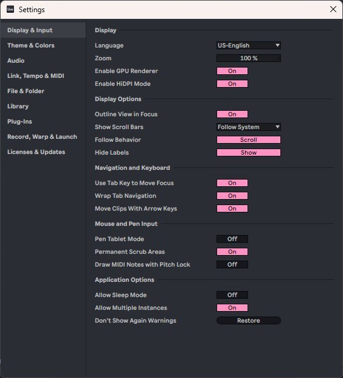
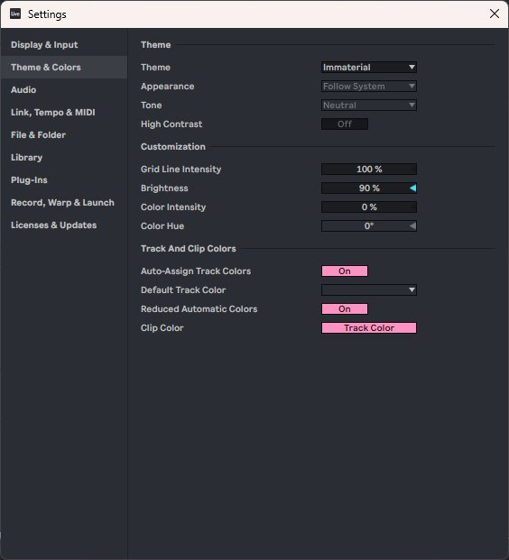
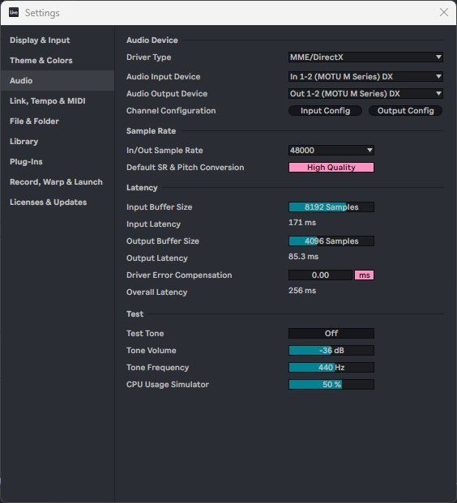
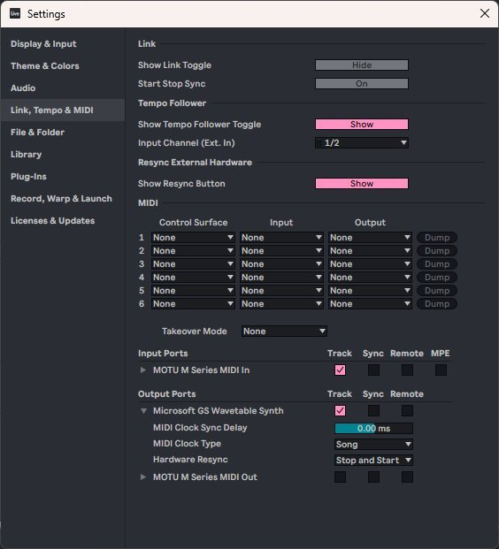
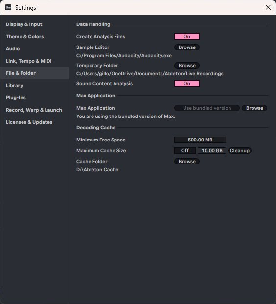
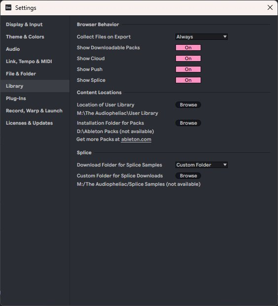
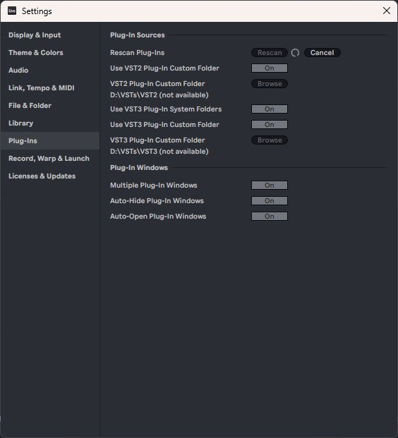
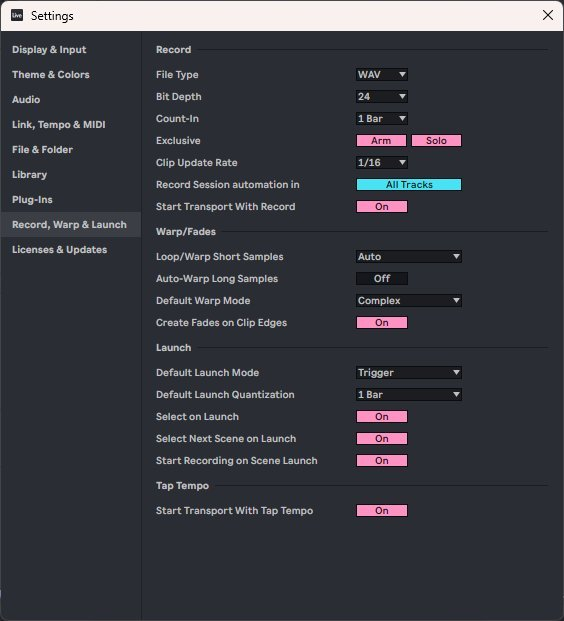
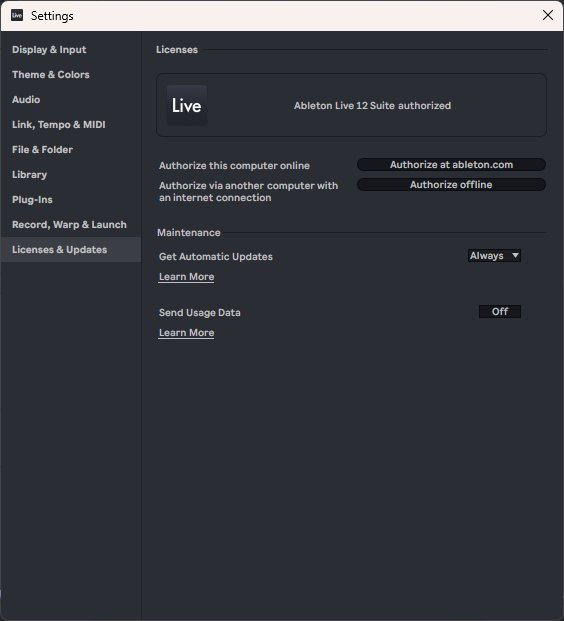

  

# Ableton Live 12 Suite — Settings Reference

**The Audiopheliac — DAW Configuration Snapshot**
Maintainer: Gillon "Gill" Marchetti (MarcArmy2003)
Captured: May 31, 2026 (initial); revised same day to reflect Live 12.4.1 tab split
Host: GDMARCHE (Dell Precision 7540, Windows 11 Pro)
Interface of record: MOTU M4 (MOTU M Series driver)
Live version: Ableton Live 12 Suite 12.4.1 (authorized; auto-updated from 12.3.4 during Mentor Lesson 2 mid-session)

> Purpose: A captured snapshot of every Settings tab in Live 12 as currently configured on GDMARCHE. Use as a baseline to restore, compare, or troubleshoot. Each section lists the live values from the screenshots, followed by the screenshot itself.

> Layout note: Live 12.4.1 split the legacy "Link, Tempo & MIDI" Settings tab into two separate tabs (Link, with a new Link Audio subsection; and Tempo & MIDI). This snapshot reflects the post-12.4.1 layout. The image `images/04_link_tempo_midi.png` is the pre-split capture and is referenced by both §4 and §5 until the screenshots are recaptured into `images/04_link.png` and `images/05_tempo_midi.png`.

---

## Table of Contents

1. [Display & Input](#1-display--input)
2. [Theme & Colors](#2-theme--colors)
3. [Audio](#3-audio)
4. [Link](#4-link)
5. [Tempo & MIDI](#5-tempo--midi)
6. [File & Folder](#6-file--folder)
7. [Library](#7-library)
8. [Plug-Ins](#8-plug-ins)
9. [Record, Warp & Launch](#9-record-warp--launch)
10. [Licenses & Updates](#10-licenses--updates)
11. [Known Path Issues Flagged in This Snapshot](#11-known-path-issues-flagged-in-this-snapshot)

---

## 1. Display & Input

**Display**
- Language: US-English
- Zoom: 100%
- Enable GPU Renderer: On
- Enable HiDPI Mode: On

**Display Options**
- Outline View in Focus: On
- Show Scroll Bars: Follow System
- Follow Behavior: Scroll
- Hide Labels: Show

**Navigation and Keyboard**
- Use Tab Key to Move Focus: On
- Wrap Tab Navigation: On
- Move Clips With Arrow Keys: On

**Mouse and Pen Input**
- Pen Tablet Mode: Off
- Permanent Scrub Areas: On
- Draw MIDI Notes with Pitch Lock: Off

**Application Options**
- Allow Sleep Mode: Off
- Allow Multiple Instances: On
- Don't Show Again Warnings: Restore (button)

---

## 2. Theme & Colors

**Theme**
- Theme: Immaterial
- Appearance: Follow System
- Tone: Neutral
- High Contrast: Off

**Customization**
- Grid Line Intensity: 100%
- Brightness: 90%
- Color Intensity: 0%
- Color Hue: 0 degrees

**Track And Clip Colors**
- Auto-Assign Track Colors: On
- Default Track Color: (dropdown, none selected)
- Reduced Automatic Colors: On
- Clip Color: Track Color

---

## 3. Audio

**Audio Device**
- Driver Type: MME/DirectX
- Audio Input Device: In 1-2 (MOTU M Series) DX
- Audio Output Device: Out 1-2 (MOTU M Series) DX
- Channel Configuration: Input Config / Output Config (buttons)

**Sample Rate**
- In/Out Sample Rate: 48000
- Default SR & Pitch Conversion: High Quality

**Latency**
- Input Buffer Size: 8192 Samples
- Input Latency: 171 ms
- Output Buffer Size: 4096 Samples
- Output Latency: 85.3 ms
- Driver Error Compensation: 0.00 ms
- Overall Latency: 256 ms

**Test**
- Test Tone: Off
- Tone Volume: -36 dB
- Tone Frequency: 440 Hz
- CPU Usage Simulator: 50%

> Note: Driver Type is set to MME/DirectX, not ASIO. The MOTU M Series ASIO driver (4.5.0.551 per mentor skill current state) gives lower latency than the DX path. Overall latency of 256 ms is high for tracking. This is acceptable for vinyl capture and playback but worth a deliberate decision before live recording or monitoring through Live.

---

## 4. Link

> Note: Live 12.4.1 split the legacy "Link, Tempo & MIDI" tab into two separate tabs (Link and Tempo & MIDI) and added a Link Audio section to the Link tab. This snapshot reflects post-12.4.1 layout (auto-updated during a Mentor lesson on 2026-05-31). Defaults differ from the pre-12.4.1 capture: Show Link Toggle was Hide, now Show; Start Stop Sync was On, now Off. Both are 12.4.1 defaults; neither matters for the vinyl-capture workflow.

**Link**
- Show Link Toggle: Show
- Start Stop Sync: Off

**Link Audio**
- Audio: Off
- Name: Live
- Latency: 100 ms
- Sync to Incoming Audio: Off (greyed; only active when Link Audio is On)

**Peers**
- (empty list; placeholder text reads "Enable Link to show available peers.")

> What this is: Ableton Link is Ableton's network sync technology for keeping multiple devices and music apps in time over a wired or wireless network. Used for collaborative jams across multiple Ableton instances, iOS music apps, Push 3 standalone, etc. The Link Audio sub-feature streams actual audio (not just tempo metadata) across Link. Not relevant to solo vinyl-rip workflow.

---

## 5. Tempo & MIDI

> Note: post-12.4.1 split tab; content moved verbatim from the legacy combined Link/Tempo/MIDI tab.

**Tempo Follower**
- Show Tempo Follower Toggle: Show
- Input Channel (Ext. In): 1/2

**Resync External Hardware**
- Show Resync Button: Show

**MIDI — Control Surfaces (rows 1-6)**
- All six rows: Control Surface = None, Input = None, Output = None (Dump buttons present per row)
- Takeover Mode: None

**Input Ports**
- MOTU M Series MIDI In: Track = On, Sync = off, Remote = off, MPE = off

**Output Ports**
- Microsoft GS Wavetable Synth: Track = On, Sync = off, Remote = off
  - MIDI Clock Sync Delay: 0.00 ms
  - MIDI Clock Type: Song
  - Hardware Resync: Stop and Start
- MOTU M Series MIDI Out: Track = off, Sync = off, Remote = off

> What this is: Tempo Follower analyzes incoming audio to derive a tempo for live-performance situations. Resync External Hardware exposes a button to manually re-sync external MIDI gear. MIDI section configures Control Surfaces (e.g., Push), MIDI input/output port enablement, and MIDI clock for synced external hardware. Not relevant to solo vinyl-rip workflow.

---

## 6. File & Folder

**Data Handling**
- Create Analysis Files: On
- Sample Editor: C:/Program Files/Audacity/Audacity.exe
- Temporary Folder: C:/Users/gillo/OneDrive/Documents/Ableton/Live Recordings
- Sound Content Analysis: On

**Max Application**
- Max Application: Use bundled version (currently using the bundled version of Max)

**Decoding Cache**
- Minimum Free Space: 500.00 MB
- Maximum Cache Size: 10.00 GB (Off / Cleanup controls present)
- Cache Folder: D:\Ableton Cache

> Note: Sample Editor is wired to Audacity, which matches the vinyl-capture lesson workflow (Audacity is primary for capture, Live for DAW literacy). Temporary Folder sits inside OneDrive; recordings landing in a cloud-synced path can cause sync churn and lock contention during active sessions. Worth relocating to a local non-synced path before heavy recording.

---

## 7. Library

**Browser Behavior**
- Collect Files on Export: Always
- Show Downloadable Packs: On
- Show Cloud: On
- Show Push: On
- Show Splice: On

**Content Locations**
- Location of User Library: M:\The Audiopheliac\User Library
- Installation Folder for Packs: D:\Ableton Packs (not available)
- Get more Packs at ableton.com (link)

**Splice**
- Download Folder for Splice Samples: Custom Folder
- Custom Folder for Splice Downloads: M:/The Audiopheliac/Splice Samples (not available)

> Note: Two paths are flagged "(not available)" in this snapshot: the Packs folder on D: and the Splice folder on M:. M: is the NAS music share (\\NAS87828E\Music); if the NAS is unmapped at launch, M: paths read as unavailable. Verify drive mapping before assuming a config problem. The User Library on M: will have the same dependency.

---

## 8. Plug-Ins

**Plug-In Sources**
- Rescan Plug-Ins: Rescan / Cancel (buttons)
- Use VST2 Plug-In Custom Folder: On
- VST2 Plug-In Custom Folder: D:\VSTs\VST2 (not available) — Browse
- Use VST3 Plug-In System Folders: On
- Use VST3 Plug-In Custom Folder: On
- VST3 Plug-In Custom Folder: D:\VSTs\VST3 (not available) — Browse

**Plug-In Windows**
- Multiple Plug-In Windows: On
- Auto-Hide Plug-In Windows: On
- Auto-Open Plug-In Windows: On

> Note: Both custom VST folders on D: show "(not available)". If those directories do not exist yet, create them or repoint before relying on third-party plugins. VST3 System Folders is On, so factory-path VST3s still load regardless.

---

## 9. Record, Warp & Launch

**Record**
- File Type: WAV
- Bit Depth: 24
- Count-In: 1 Bar
- Exclusive: Arm / Solo (both shown)
- Clip Update Rate: 1/16
- Record Session automation in: All Tracks
- Start Transport With Record: On

**Warp/Fades**
- Loop/Warp Short Samples: Auto
- Auto-Warp Long Samples: Off
- Default Warp Mode: Complex
- Create Fades on Clip Edges: On

**Launch**
- Default Launch Mode: Trigger
- Default Launch Quantization: 1 Bar
- Select on Launch: On
- Select Next Scene on Launch: On
- Start Recording on Scene Launch: On

**Tap Tempo**
- Start Transport With Tap Tempo: On

> Note: File Type WAV at 24-bit matches the studio default (48 kHz / 24-bit daily capture). This is correctly aligned with the vinyl-capture standard. For archive-grade album captures, the session sample rate steps up to 96 kHz / 24-bit, set per session in the Audio tab.

---

## 10. Licenses & Updates

**Licenses**
- Status: Ableton Live 12 Suite + 1 add-on authorized (the "+ 1 add-on" is Beat Tools, the third serial on Gill's account alongside Live 12 Suite (Upgrade) and Live 12 Lite; Beat Tools authorized into Live's runtime after the initial 2026-05-31 snapshot was captured)
- Authorize this computer online: Authorize at ableton.com (button)
- Authorize via another computer with an internet connection: Authorize offline (button)

**Maintenance**
- Get Automatic Updates: Always
- Send Usage Data: Off

---

## 11. Known Path Issues Flagged in This Snapshot

These are the items showing "(not available)" or otherwise worth a deliberate decision. None are errors on their own; several depend on NAS mapping at launch.

| Setting | Tab | Current Value | Flag |
| --- | --- | --- | --- |
| Audio Input/Output Device | Audio | MOTU M Series DX (MME/DirectX) | Not ASIO. 256 ms overall latency. Fine for capture/playback, high for live monitoring through Live. |
| Temporary Folder | File & Folder | OneDrive path | Cloud-synced recording path risks sync churn / lock contention. |
| Installation Folder for Packs | Library | D:\Ableton Packs | Marked not available. |
| Splice Custom Folder | Library | M:/The Audiopheliac/Splice Samples | Marked not available (NAS path; verify M: mapping). |
| User Library | Library | M:\The Audiopheliac\User Library | NAS path; same M: mapping dependency. |
| VST2 Custom Folder | Plug-Ins | D:\VSTs\VST2 | Marked not available. |
| VST3 Custom Folder | Plug-Ins | D:\VSTs\VST3 | Marked not available. |

> These are observations, not fixes. Resolution belongs to a Cowork/CLI session against the actual disk and NAS state, per verification-first rule. Confirm M: mapping (`net use`) before treating any M: path as broken.

---

*The Audiopheliac — Studio Assistant Mode | "Where every cable, waveform, and decibel earns its keep."*
